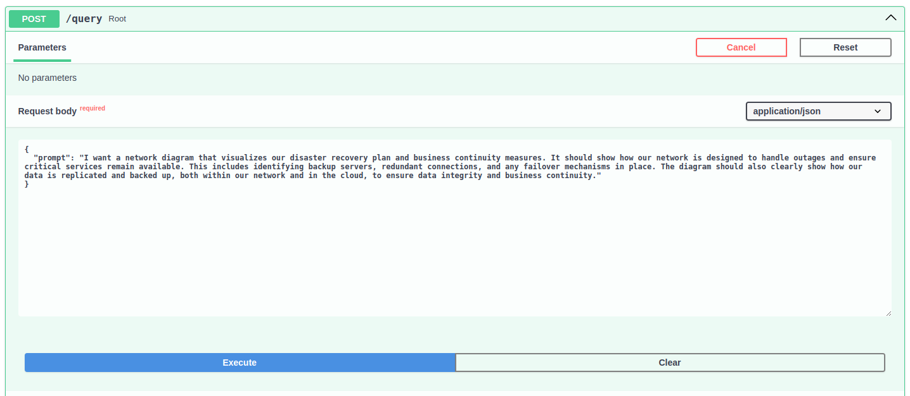

# VMRecommender

## Getting started

This project aims to build a dynamic network diagram generator using a Retrieval Augmented Generation (RAG) system. By leveraging a database of VM types, we'll design a workflow that takes customer specifications as input and produces an output representing a complete network diagram. This includes the allocation of virtual machines, VLAN configuration, and the specific details of each chosen machine type. This approach promises a highly automated and flexible solution for creating tailored network diagrams based on customer needs.

## Technologies used

+ LLM choice: I used TinyLlama because of its light-weight but robust in processing language. 
+ Vector storing: In this project, I prefer FAISS to other because it is a vector indexing. Every information, that is embedded, is wrapped in an object. At this moment, the dataset is quite small, therefore, it would reduce the storing cost. 

## Usage

1. Cloning the project and install requirements: 

```
git clone https://github.com/MinLee0210/VMRecommender
cd VMRecommender 
pip install -r requirments.txt
```
2. Ready to use

```
python main.py
```

## Gallery

+ Asking the `TinyAgent`: 



+ The generated result: 


## Problems

+ User's description is not clear and attach with the information from the dataset => hard for the retrieval.
+ The generated reponse is still not attached with the relevant context => poor UX. 
+ The storing object is not set-up globally. It needs to be processed every request => high latency.